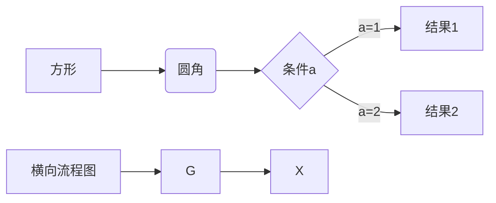

### a new day

- 9.15
  > - 一切都是最好的安排
  > - 当下已经是最美的了
  - 目标，接下来的目标是什么
  - nohow，接下来要怎么做
  - 确保，接下来怎么确保能道道目标

- 13.35 
    > c++ faq lite 刷了一遍了，
    > 后面要快速的把c++ primer、effective、more effective刷一遍
    > 
    真的好好搞两年C++，搭起一套智能机器人系统，把整个智驾系统，移动机器人系统真正的掌握，也就是一整套Apollo系统或者轻量化的Apollo系统
- 14.20 primer 先撸一遍，
- 16.11 走马观花，回头用到再查阅，
  > 眼下只有靠自己了，淡定点，几件重要的事情做做好，就可以了
  - 七个习惯
    - 积极主动
    - 双赢思维
    - 要事第一
    - 以终为始
    - 知彼解肌
    - 统合综小
    - 不断更新

- 坚持着做好自己，做好自己的核心竞争力，放平心态，放下姿态，放出态度
- 整体上，还是十分具备竞争力的，靠死磕自己

